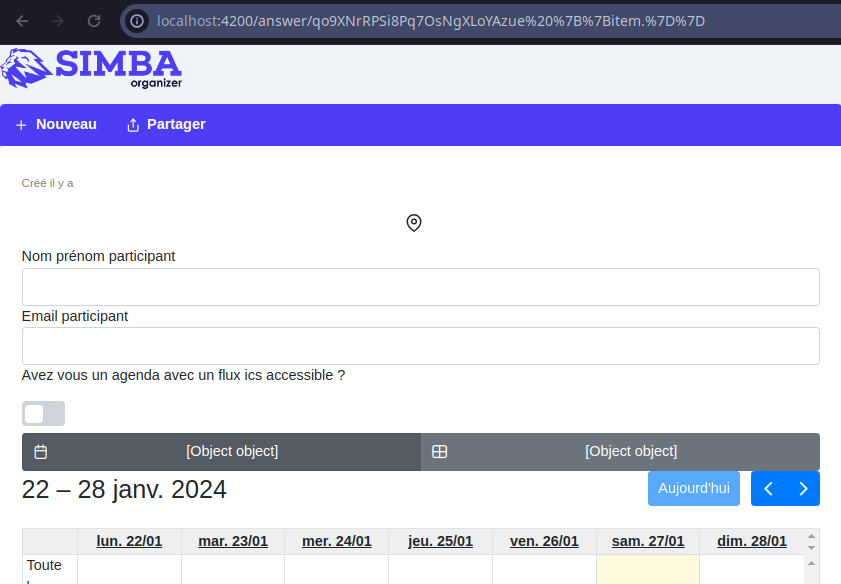
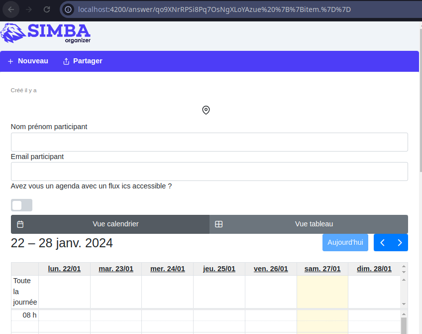

# FindABug

Samuel SOUTREL

Baptiste MEAUZÉ

## Énoncé : 

*Clone the Simba Organizer repository and follow the instructions to run the application on your machine. Find a bug in the application. With the help of Selenium and the Page Object Model desing pattern write a simple test that fails for this bug.Optionally make a pull request to the project. Include in this document the code of the test and, if you did it, the link to the pull request.*

## Réponse :

L'anomalie que nous avons choisit de corriger est la suivante :



Nous remmarquons qu'il y a écrit "[Object object]" à la place "Vue tableau" et "Vue calendrier". Ceci est une anomalie.

Afin de corriger cette anomalie, nous avons réaliser un PageObjectModel de la page answer de l'application Doodle. Et nous avons réaliser des test JUnit à l'aide de ce PageObjectModel. 

Cf. AnswerPageTest.java
&  AnswerPage.java


L'anomalie une fois corrigé :



Pour corriger cette anomalie j'ai modifié le code de 

answer-poll.component.html

```
<div>
          <p-selectButton  [options]="calendarortableoption" [(ngModel)]="calendarortable">
            <ng-template let-item>
              <i [class]="item.icon">Vue {{item.text}}</i>
            </ng-template>
          </p-selectButton>
        </div>

        <div *ngIf="calendarortable ==='calendar'">
          <full-calendar #calendar [options]="options"></full-calendar>
        </div>

        <div *ngIf="calendarortable !='calendar'">
        ...

```
en 

```
<div>
          <p-selectButton  [options]="calendarortableoption" [(ngModel)]="calendarortable" optionLabel="text">
            <ng-template let-item>
              <i [class]="item.icon"></i>
            </ng-template>
          </p-selectButton>
        </div>

        <div *ngIf="calendarortable.value ==='calendar'">
          <full-calendar #calendar [options]="options"></full-calendar>
        </div>

        <div *ngIf="calendarortable.value !='calendar'">
        ...
```


ainsi que answer-poll.component.html

```
  calendarortable = 'calendar';
```

en 

```
calendarortable = { icon: 'pi pi-table', text: 'Tableau', value: 'table' }
```